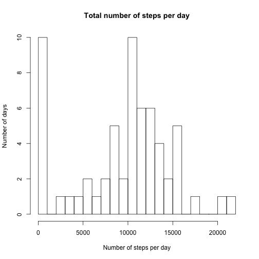
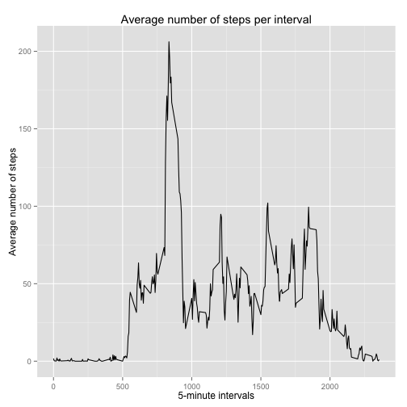
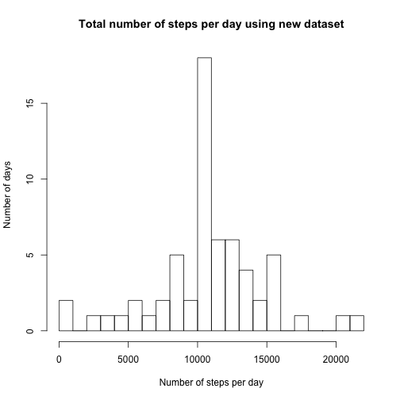
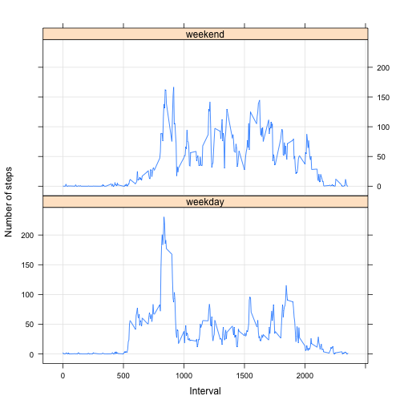

library(plyr)

####Loading and preprocessing the data


```r
rawData <- read.csv("activity.csv", header = TRUE, sep = ",")
rawData$date <- as.Date(rawData$date)    
```
    
####What is mean total number of steps taken per day?

#####First, we calculate total number of steps each day and plot a histogram


```r
stepsDay <- tapply(rawData$steps, rawData$date, FUN=sum, na.rm=TRUE)
hist(stepsDay, breaks=20, main = "Total number of steps per day",
     xlab = "Number of steps per day", ylab = "Number of days")
```

 

#####Next, we calculate mean and median number of steps per day


```r
meanDay <- mean(stepsDay, na.rm = TRUE)
round(meanDay, digits = 0)
```

```
## [1] 9354
```

```r
medianDay <- median(stepsDay, na.rm = TRUE)
round(medianDay, digits = 0)
```

```
## [1] 10395
```

######Average number of steps per day = 9,354  
######Median number of steps per day = 10,395

####What is the average daily activity pattern?

#####We plot a time series of average number of steps per 5-minute interval across all days


```r
library(ggplot2)

meanInterval <- aggregate(x = list(steps=rawData$steps),
                by = list(interval=rawData$interval), 
                FUN = mean, na.rm = TRUE)

ggplot(meanInterval, aes(x=interval, y=steps)) + 
    geom_line() +
    ggtitle("Average number of steps per interval") +
    xlab("5-minute intervals") +
    ylab("Average number of steps")
```

 

#####We identify the 5-minute interval that has the maximum number of steps


```r
maxStep <- meanInterval[which.max(meanInterval$steps),]
round(maxStep, digits = 0)
```

```
##     interval steps
## 104      835   206
```

######Interval 835, which occured on Oct 1, 2012, 206 steps were taken, higher than number of steps taken on any other intervals 

####Imputing missing values

#####First, we calculate and report the total number of missing values in the dataset 


```r
table (is.na(rawData))
```

```
## 
## FALSE  TRUE 
## 50400  2304
```

There are 2,304 missing values in the data. 

#####Next, we use the mean for the 5-minute interval to fill in missing values and create a new dataset


```r
newData <- rawData
newData$steps[is.na(newData$steps)] <- 
    tapply(newData$steps, newData$interval, mean, na.rm = TRUE)

#Check to make sure missing values are filled
table(is.na(newData))
```

```
## 
## FALSE 
## 52704
```

####Are there differences in activity patterns between weekdays and weekends?

#####1. We plot a histogram of total number of steps per day using the new dataset


```r
stepsDayNew <- tapply(newData$steps, newData$date, FUN=sum, na.rm=TRUE)
hist(stepsDayNew, breaks=20, main = "Total number of steps per day using new dataset",
     xlab = "Number of steps per day", ylab = "Number of days")
```

 

######The histogram using the new dataset is closer to a 'normal distribution' as filled-in values for missing days helped to 'normalize' the data.

#####2. We calculate mean and median number of steps per day using new dataset


```r
meanDayNew <- mean(stepsDayNew, na.rm = TRUE)
round(meanDayNew, digits = 0)
```

```
## [1] 10766
```

```r
medianDayNew <- median(stepsDayNew, na.rm = TRUE)
round(medianDayNew, digits = 0)
```

```
## [1] 10766
```

######Once missing values are filled in with interval means, the average and median number of steps per day increased:  
######Average number of steps per day - old=9,354 new=10766  
######Median number of steps per day - old=10,395 new=10766

#####3. We calculate means and medians for weekdays and weekends separately using new dataset


```r
#add a factor variable to the new dataset to indicate whether a given date is a weekday or weekend day

newData$date <- as.Date(newData$date)
newData$dayType <- factor(format(newData$date, "%A"))
levels(newData$dayType) <- list(weekday=c("Monday", "Tuesday", "Wednesday", "Thursday", "Friday"), weekend=c("Saturday", "Sunday"))
```

#####4. We make a panel plot with time series to compare activity patterns between weekdays and weekends


```r
meanIntervalNew <- aggregate(steps ~ interval + dayType,
                             data = newData, FUN = mean)

library(lattice)
xyplot(type = "l", data = meanIntervalNew,
       steps ~ interval | dayType,
       layout = c(1,2), grid = T,
       xlab ="Interval",
       ylab = "Number of steps")
```

 

######Conclusion: more steps were taken on weekends than on weekdays.
